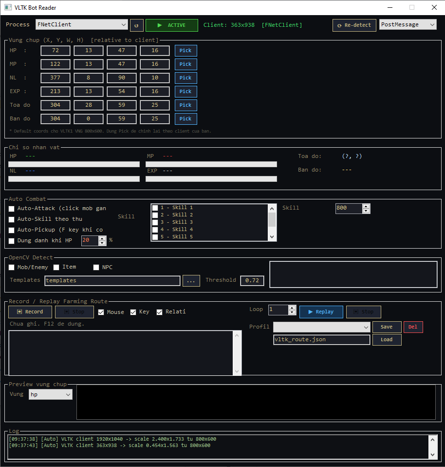

# VLTK Bot - Võ Lâm Truyền Kỳ 1 (VNG)

<p align="center">
  
</p>

## Yêu cầu
- .NET 9 SDK: https://dotnet.microsoft.com/download/dotnet/9.0
- VLTK1 VNG client (process: elementclient)

## Build
```
build_VLTK.bat
```

## tessdata (OCR tọa độ/tên map)
Cần 2 file trong `libs\tessdata\`:
- `eng.traineddata` — đã có sẵn
- `vie.traineddata` — tải tại:
  https://github.com/tesseract-ocr/tessdata/raw/main/vie.traineddata

## ⚠️ HUD Coords — đã đo từ ảnh chụp gameplay thực tế

Nhờ 2 ảnh chụp gameplay bạn gửi (720x540 và 803x605, quy đổi về chuẩn 800x600), đã
đo lại pixel thật và **sửa 2 nhầm lẫn quan trọng** so với bản trước:

1. **HUD nằm ở GÓC TRÊN TRÁI màn hình**, không phải dưới đáy như bản cũ giả định.
2. **Thứ tự màu**: HP là thanh **XANH LÁ** (không phải đỏ), MP là thanh **ĐỎ**
   (không phải xanh lam). Thứ tự đầy đủ từ trái sang phải: `Cấp [xanh lá HP] [đỏ MP]
   [xanh dương Nội Lực] [thanh bạc nhỏ EXP%] Hạng [tên nhân vật]`.

Bot giờ đã hỗ trợ đọc thêm thanh **Nội Lực (NL)** — trước đây hoàn toàn chưa có.

| Vùng      | X   | Y  | W   | H  | Mô tả                                   |
|-----------|-----|----|-----|----|------------------------------------------|
| HP bar    | 158 | 8  | 104 | 10 | Thanh **xanh lá**, góc trên trái        |
| MP bar    | 268 | 8  | 104 | 10 | Thanh **đỏ**, ngay sau HP               |
| Nội Lực   | 377 | 8  | 90  | 10 | Thanh **xanh dương**, ngay sau MP       |
| EXP bar   | 470 | 8  | 120 | 10 | Thanh **bạc/xám sáng** nhỏ, sau Nội Lực |
| Tọa độ    | 670 | 18 | 130 | 16 | OCR, dưới tên vùng, cạnh minimap phải   |
| Tên vùng  | 670 | 0  | 130 | 16 | OCR, phía trên tọa độ, cạnh minimap     |

Dùng nút **Pick** để khoanh vùng chính xác theo độ phân giải/client thật của bạn —
tọa độ trên chỉ là ước lượng tốt từ 2 ảnh mẫu, có thể lệch nếu client bạn khác
800x600 hoặc giao diện đã được mod màu.

## Màu pixel detect (đã đo lại từ ảnh thật)
| Mục       | Điều kiện                                    |
|-----------|-----------------------------------------------|
| HP bar    | G>130, R<170, B<110 (xanh lá)                 |
| MP bar    | R>150, G<100, B<100 (đỏ tươi)                 |
| Nội Lực   | B>140, R<110, G<140 (xanh dương)              |
| EXP bar   | R>140, G>130, B>110 (bạc/xám sáng, dò theo độ sáng vì không có màu đặc trưng riêng — màu thực tế có thể ngả tan/be tùy ánh sáng/nén ảnh, nên **luôn Pick lại** nếu đọc sai) |
| Tên mob   | R>180, G<80, B<80 (chữ đỏ trên đầu)            |
| Item drop | R>200, G>180, B<80 (ánh vàng)                  |

## Templates
Chụp ảnh PNG từ game đặt vào:
```
build\Release\templates\
  mobs\   <- ảnh PNG tên/portrait mob (VD: mob_skeleton.png)
  items\  <- icon item drop (VD: item_sword.png)
  npcs\   <- ảnh NPC (VD: npc_blacksmith.png)
```

## Skill hotkeys VLTK
1-6 = Skill trên thanh skill bar
F   = Nhặt đồ (pickup)
F12 = Dừng record
